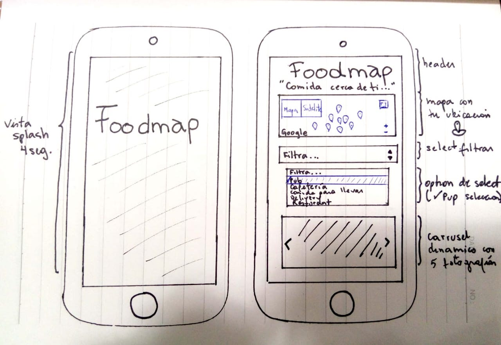
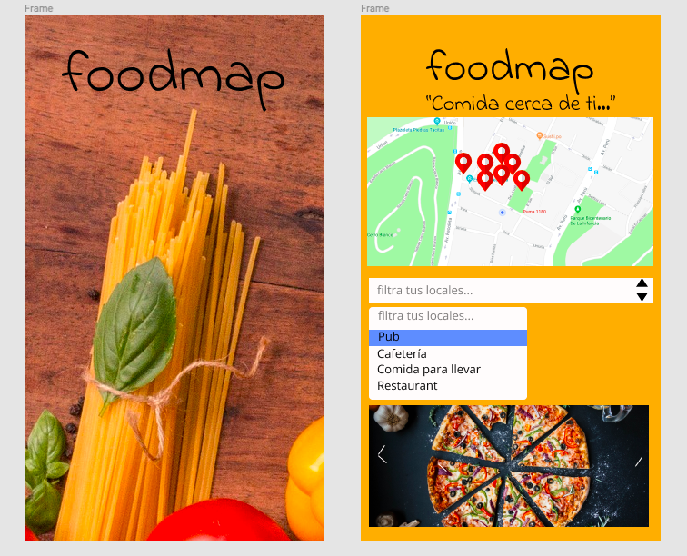

#  F O O D M A P

Foodmap es un sitio web de geolocalizacion que te ayudrá en contrar los locales de comida cerca de ti, con un radio de 2 kms.
Las bonadades de Foodmap es que es de fácil uso, ya que solo tienes que permitir que se verifique tu ubicacion y luego seleccionar una opcion de local que quieras buscar.

Si quieres ingresar y realizar tus búsquedas pincha el link.

()

## Diseño

principalmente está enfocado en la funcionalidad por ende su diseño minimalista no distrae de lo medular.
Aquí una muestra del primer boceto de diseño.

### Sketch

Ahora una muestra del diseño prototipado con Figma.

### Prototipo de Alta fidelidad

